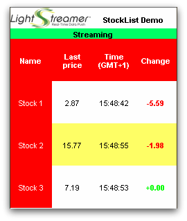

# Lightstreamer - Basic Stock-List and Round-Trip Demo - BlackBerry Client

<!-- START DESCRIPTION lightstreamer-example-stocklist-client-blackberry -->

This project contains a full example of a Midlet Java application that employs the <b>BlackBerry Client API for Lightstreamer</b>.

## Live Demo

 
### [ View live demo](http://demos.lightstreamer.com/bb/lsbbdemo.jad) 

## Details

This BlackBerry application contains two different screens: one with three stock quotes from the [Lightstreamer - Stock-List Demos - HTML Clients](https://github.com/Lightstreamer/Lightstreamer-example-Stocklist-client-javascript), the other with four items from the [Lightstreamer - Round-Trip Demo - HTML Client](https://github.com/Lightstreamer/Lightstreamer-example-RoundTrip-client-javascript).
This app uses the [BlackBerry Client API for Lightstreamer](http://www.lightstreamer.com/docs/client_blackberry_api/index.html) to handle the communications with Lightstreamer Server. 

When the Basic Stock-List Demo is connected, you will see the yellow flashing cells of the [Stock-List Demos](https://github.com/Lightstreamer/Lightstreamer-example-Stocklist-client-javascript). Use the menu to switch to the other demo, where you can see the values of some items of the [Round-Trip Demo](https://github.com/Lightstreamer/Lightstreamer-example-RoundTrip-client-javascript) updated in real-time. To publish new values, use the menu. 

You can open the [Round-Trip Demo](https://github.com/Lightstreamer/Lightstreamer-example-RoundTrip-client-javascript) on a PC browser and see the values synchronized with the mobile phone.

### Dig the Code
The application is divided into 8 main public classes.
* <b>LightstreamerDemoMidlet</b>: this is the entry point of the application. It extends the MIDlet class to be run as an application and implements the CommandListener interface to receive menu commands. This class is responsible of server connection and table subscriptions.
* <b>LSDisplayListener</b>: this class extends Canvas: it is the visual part of the application. It also implements the SimpleTableListener as this class is also used to receive updates from the LSClient instance of the LightstreamerDemoMidlet class. This class cannot be used as-is, it is just an abstract class to be used as base to implement real views.
* <b>LSDisplayListenerStockList & LSDisplayListenerRoundTrip</b> extend the LSDisplayListener showing the data pertaining to the related demo.
* <b>GraphicsTable</b> is a helper class that is used by LSDisplayListener classes to print a table that fits the monitor in use.
* <b>SubmitForm</b> is a simple CommandListener that is used to obtain from the user a message to be sent to the server (for the interaction demo part of the demo).
* <b>ErrorPrompt</b> is a simple CommandListener that is used to show error messages (if any). During development, it can also be used as in-device logging facility.
* <b>BBConnectionProvider</b> is a key class for the BlackBerry demo. It implements the ConnectionProvider to customize urls before those are used by the Lightstrteamer client library. Url customization is needed by BlackBerry devices to access the Internet through different transports (see [here](http://supportforums.blackberry.com/t5/Java-Development/Network-Transports/ta-p/482457)). The current implementation supports WiFi, public MDS, and direct TCP connections.
 

If you want to skip the build and deploy processes of this demo, please note that you can click the image or link in the [Live Demo](https://github.com/Lightstreamer/Lightstreamer-example-StockList-client-blackberry#live-demo) section above to download a `.jad` file to your phone. As an alternative, point your mobile browser to the URL: [http://demos.lightstreamer.com/bb/lsbbdemo.jad](http://demos.lightstreamer.com/bb/lsbbdemo.jad). 
Once installed on your phone, run the application, give the requested rights, and wait for the connection to be established (as shown in the top green bar). If no connection can be established but your phone is connecting to the Internet properly for other applications, it probably means that the access point list configured in the demo is not compatible with your phone configuration. You might want to contact [support](support@lightstreamer.com) for further information.

Check out the sources for further explanations.
<!-- END DESCRIPTION lightstreamer-example-stocklist-client-blackberry -->

## Build

To build your own version of the demo, instead of using the one provided in the [Live Demo](https://github.com/Lightstreamer/Lightstreamer-example-StockList-client-blackberry#live-demo) section above, consider that this example is comprised of the following folders:
* `/src` 
  Contains the sources to build the java application.

* `/res` 
  Contains the images needed to the demo.
  
* `/lib` 
  Drop here the `ls-bb-client.jar` from the Lighstreamer SDK for BlackBerry Clients, to be used for the build process and execution.

### Getting Started

Unfortunately, at the time of writing, it's not possible to run the demo application with Eclipse and its BlackBerry Java Plug-in because of an issue related to importing external jar files to a project, see [here](http://supportforums.blackberry.com/t5/Java-Development/Adding-External-Jars-using-eclipse/m-p/95205).
  
So it is necessary to use RIM JDE, which is windows only; download it from [http://developer.blackberry.com/bbos/java/download/jde/](http://developer.blackberry.com/bbos/java/download/jde/) and install it. On Windows 7, you may have issues running it from the Programs folder; I suggest you to install it under the user space. Also, to run the IDE, you'll need to use a 32 bit java VM. If your system defaults to a 64 bit JVM, you'll have to edit the ide.bat file located under the `JDE_HOME/bin` folder.
Once ready, launch the IDE, double-clicking the `ide.bat` file; the JDE should start.
  
<i>NOTE: If you want to try Eclipse anyway, you can download the BlackBerry plugin from [http://us.blackberry.com/developers/javaappdev/javaplugin.jsp](http://us.blackberry.com/developers/javaappdev/javaplugin.jsp). Alternatively, there is an update site located at [http://www.blackberry.com/go/eclipseUpdate/3.5/java](http://www.blackberry.com/go/eclipseUpdate/3.5/java).</i>

### Compile and Run
From inside the JDE, create a new Midlet project by clicking File->New. Then, select the Projects tab and choose Midlet. If necessary, you may have to create a workspace first. Once the project is ready, right-click it and select add files to project. 
Add all the example files to the project, excluding the lib jar and the `BlackBerry_App_Descriptor.xml` (it seems that JDE ignores it). Right-click the project again and select properties. In the Application tab, select MIDlet as application type and set LightstreamerDemoMidlet as main class.
  
Now we have to add the client jar to compile and run the project: From your Lightstreamer installation extract the file included in the `Lightstreamer/DOCS-SDKs/sdk_client_blackberry/sdk_client_blackberry7/lib` and use that file.
In the JDE, create a new Library project and add the jar to it. Then right-click on it and select build project.
Finally, right-click on the original project (the one with the sources) and select Project Dependencies; select the other project and click ok. Build it and you should  now be able to run the demo. 
 
There a couple of things to keep in mind when building the .cod of the demo with rapc: if you pass the Lightstreamner BlackBerry client library jar `ls-bb-client.jar` to the rapc as an "import" entry, then you'll have to separately install the Lightstreamer library on the BlackBerry device before you can run the application there.
A different approach is to specify the library as a `src` element. In doing so, the library will be embedded in the final cod. The drawback of this approach is that also the library MANIFEST file and the version files (`version.number build.number` and `compatibility_version.number`) of the library will be embedded in the final cod so that you may want to remove such files from the library jar before calling rapc.
As a final note, do not specify the lib both as "import" and as "src" or you'll get a "Duplicate definition" error.

### Deploy
  
By the current configuration, specified in `LightstreamerDemoMidlet.java` and used by the provided precompiled files, the demo tries to connect to the demo server currently running on Lightstreamer website.
The demo can be reconfigured and recompiled to connect to the local installation of Lightstreamer Server. Only the host name and the port number have to be changed in the source code.
The example requires that the [QUOTE_ADAPTER](https://github.com/Lightstreamer/Lightstreamer-example-Stocklist-adapter-java) and [ROUNDTRIP_ADAPTER](https://github.com/Lightstreamer/Lightstreamer-example-RoundTrip-adapter-java) have to be deployed in your local Lightstreamer server instance;
the [LiteralBasedProvider](https://github.com/Lightstreamer/Lightstreamer-example-ReusableMetadata-adapter-java) is also needed, but it is already provided by Lightstreamer server. 

## See Also

### Lightstreamer Adapters Needed by This Demo Client
<!-- START RELATED_ENTRIES -->

* [Lightstreamer - Stock-List Demo - Java Adapter](https://github.com/Lightstreamer/Lightstreamer-example-Stocklist-adapter-java)
* [Lightstreamer - Reusable Metadata Adapters - Java Adapter](https://github.com/Lightstreamer/Lightstreamer-example-ReusableMetadata-adapter-java)
* [Lightstreamer - Round-Trip Demo - Java Adapter](https://github.com/Lightstreamer/Lightstreamer-example-RoundTrip-adapter-java)

<!-- END RELATED_ENTRIES -->

### Related Projects

* [Lightstreamer - Stock-List Demos - HTML Clients](https://github.com/Lightstreamer/Lightstreamer-example-Stocklist-client-javascript)
* [Lightstreamer - Basic Stock-List Demo - jQuery (iqGrid) Client](https://github.com/Lightstreamer/Lightstreamer-example-StockList-client-jquery)
* [Lightstreamer - Stock-List Demo  - Dojo Toolkit Client](https://github.com/Lightstreamer/Lightstreamer-example-StockList-client-dojo)
* [Lightstreamer - Basic Stock-List Demo - Java SE (Swing) Client](https://github.com/Lightstreamer/Lightstreamer-example-StockList-client-java)
* [Lightstreamer - Basic Stock-List Demo - .NET Client](https://github.com/Lightstreamer/Lightstreamer-example-StockList-client-dotnet)
* [Lightstreamer - Round-Trip Demo - HTML Client](https://github.com/Lightstreamer/Lightstreamer-example-RoundTrip-client-javascript)

## Lightstreamer Compatibility Notes

- Compatible with Lightstreamer BlackBerry Client API v. 1.1.1 or newer.
- Ensure that BlackBerry Client API is supported by Lightstreamer Server license configuration.
